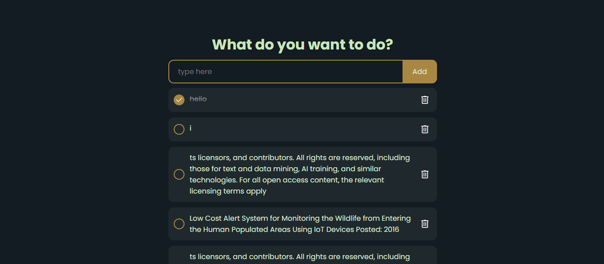

# 📝 To-Do App

A simple and lightweight To-Do list application built with **HTML**, **CSS**, and **JavaScript**. Users can add, check/uncheck, and delete tasks. The app uses **local storage** to save tasks, ensuring they persist even after the browser is closed.

---

## 🚀 Features

- ✅ Add new to-do items
- ❌ Delete items
- ✔️ Mark items as completed
- 🔄 Data persistency using **LocalStorage**
- 💡 Clean and responsive UI

---

## 📸 Screenshots

 <!-- Optional: add a screenshot image -->

---

## 🛠️ Technologies Used

- **HTML5**
- **CSS3**
- **JavaScript (ES6+)**
- **LocalStorage** API

---

## 🧠 How It Works

1. **Add a Task**  
   Enter your task in the input field and click **"Add"** or press **Enter**.

2. **Mark as Complete**  
   Click the checkbox next to an item to toggle its completion status.

3. **Delete a Task**  
   Click the 🗑️ delete button to remove a task from the list.

4. **Persistence**  
   All tasks are stored in the browser's **local storage**, so your list remains even if you reload or close the tab.

---


## 🧪 How to Use

1. Clone the repository or download the ZIP:

```bash
git clone https://github.com/kasengaefraim/todo-app.git
```

2. Open index.html in your favorite browser.

That's it! No build steps, no frameworks — just plain old web magic.

✨ Future Improvements
 Add due dates or categories

 Enable editing tasks

 Sync with cloud storage